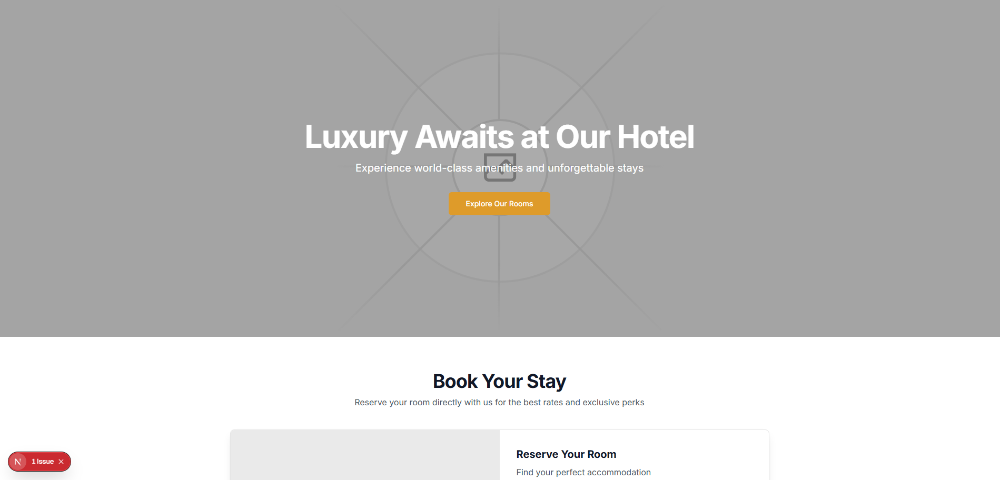
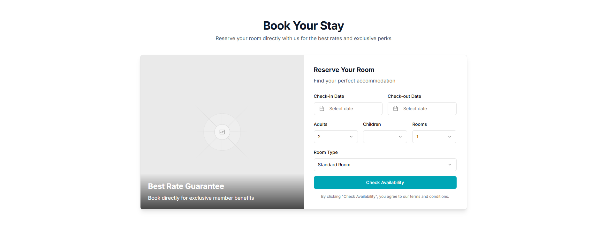
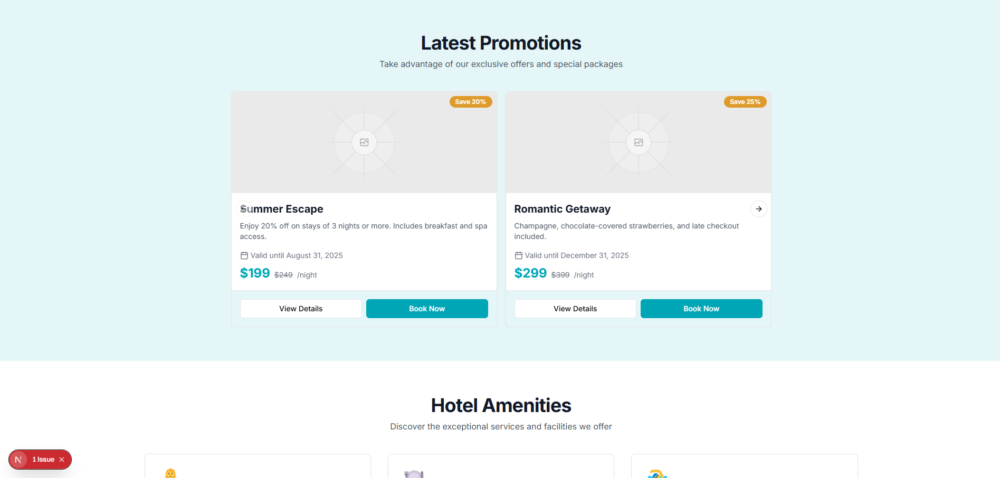

# Luxury Hotel Starter Kit – Next.js

Luxury Hotel Starter Kit is a modern landing page template built with Next.js and Tailwind CSS.  
It is designed to help developers quickly launch professional websites for hotels, guest houses, boutique accommodations, and tourism businesses.

The project provides a clean structure, responsive layouts, and reusable components that make customization straightforward.

---

## Features

- Built with Next.js
- Styled using Tailwind CSS
- Fully responsive layout
- Component-based architecture
- Optimized for performance and SEO
- Easy to customize and extend

---

## Preview

### Landing Page



### Book Your Stay


### Latest Promotions


### Join Us


---

## Tech Stack

| Technology | Description |
|------------|-------------|
| Next.js | React framework for production |
| React | User interface library |
| Tailwind CSS | Utility-first CSS framework |
| TypeScript / JavaScript | Application logic |
| Vercel | Recommended deployment platform |

---

## Getting Started

### Clone the repository

```bash
git clone https://github.com/FouedDouiri/Luxury-Hotel-starterkit-nextjs-.git
```

### Navigate to the project directory

```bash
cd Luxury-Hotel-starterkit-nextjs-
```

### Install dependencies

```bash
npm install
```

### Run the development server

```bash
npm run dev
```

Open the application in your browser:

```
http://localhost:3000
```

---

## Project Structure

```
src
 ├── app
 ├── components
 ├── styles
 ├── public
 └── assets
```

---

## Use Cases

This template can be used for:

- Boutique hotels
- Guest houses
- Riads
- Airbnb accommodations
- Tourism businesses
- Hospitality startups

---

## Customization

The template is structured to make customization simple. Developers can easily modify:

- Branding and hotel name
- Images and galleries
- Rooms and descriptions
- Contact information
- Booking links

---

## Deployment

The project can be deployed on any platform that supports Node.js. The recommended approach is using Vercel.

Build the production version:

```bash
npm run build
```

You can deploy to:

- Vercel
- Netlify
- VPS servers
- Any Node.js hosting environment

---

## Contributing

Contributions are welcome. If you would like to improve this template:

1. Fork the repository
2. Create a new branch
3. Submit a pull request

---

## License

This project is released under the MIT License.

---

## Author

Foued Douiri  
GitHub: https://github.com/FouedDouiri
